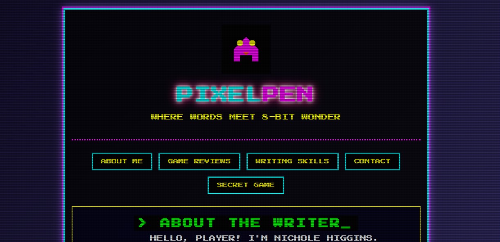

# 🕹️ PixelPen - Gaming Writer Portfolio

> **RETRO-STYLE PORTFOLIO FOR MODERN GAME WRITING**  
> *Where words meet 8-bit wonder*

[](https://worldsocoled.github.io/gaming-writer-portfolio/)



## 📟 PROJECT OVERVIEW
A fully interactive portfolio website showcasing video game journalism with a nostalgic 90s arcade aesthetic. Features CRT screen effects, pixel art elements, and retro UI components that pay homage to classic gaming while presenting modern writing samples.

**Key Features:**
- 🖤 Authentic CRT scanlines and glow effects
- 👾 Pixel-perfect responsive design
- 📜 Interactive game review showcase
- 🎮 Secret minigame easter egg
- 📟 Animated retro text elements

## 🧩 TECHNOLOGIES USED
```bash
HTML5 · CSS3 · JavaScript · Pixel Art · GitHub Pages
